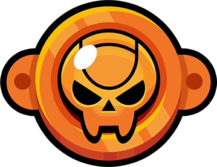

<!DOCTYPE html>
<html lang="en">
  <head>
    <meta charset="UTF-8" />
    <meta name="viewport" content="width=device-width, initial-scale=1.0" />
    <title>Guess my number</title>
    <link rel="preconnect" href="https://fonts.googleapis.com" />
    <link rel="preconnect" href="https://fonts.gstatic.com" crossorigin />
    <link
      href="https://fonts.googleapis.com/css2?family=Josefin+Sans:ital,wght@0,100..700;1,100..700&family=Montserrat:ital,wght@0,100..900;1,100..900&display=swap"
      rel="stylesheet"
    />
   <!-- <link rel="stylesheet" href="style-guessTheNumber.css" />-->
  </head>

  
  <body>
    

      <h1 class="heading-1">Guess my number</h1>
      <button class="leaderboard-btn">Leaderboard🏆</button>
    

    

      Leaderboard is currently not in function:( Please try again later.
    

    <section class="main">
      
Start guessing...

      <input class="input" type="number" />
      <button class="check">Check!!!</button>
      <button class="try-again">Try Again</button>
      <figure class="hidden-number">
?
</figure>
      

        Number of guesses: 5
      

      

        

          You are in bronze rank
        

        
      

    </section>

    
  </body>
</html>
